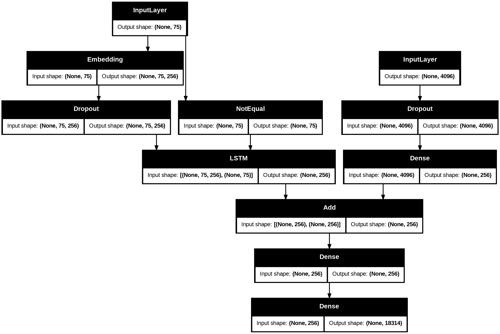
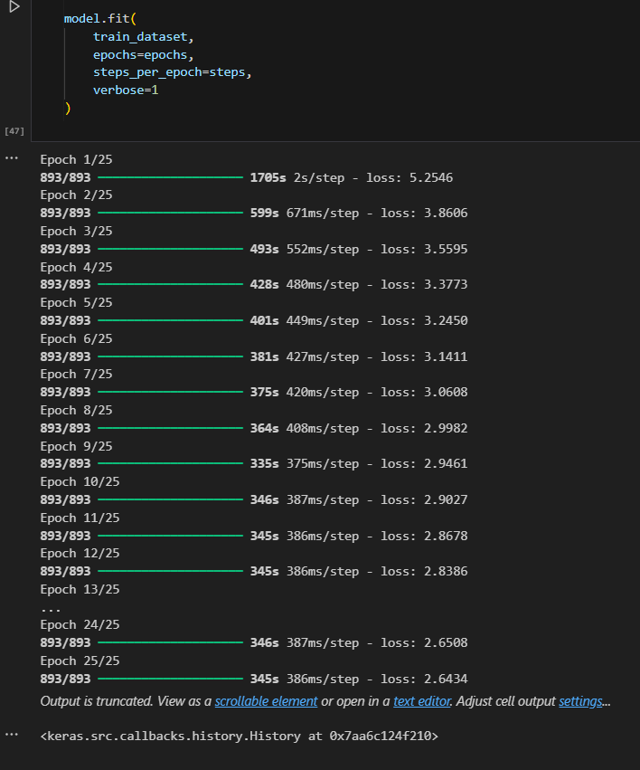

# 🖼️ Image Caption Generator

A deep-learning based project that automatically generates captions for images using a CNN + LSTM model.

---

## **🚀 Project Overview**

The Image Caption Generator takes an image as input and generates a meaningful sentence describing the content of the image.
It combines:

- CNN (VGG16) → for image feature extraction
- LSTM (RNN) → for sequence generation (captions)
- Tokenizer + Embedding Layer → for text processing
- Greedy Search → for caption generation
- The project is trained on the Flickr30k dataset.

---

## **Dataset**

- Flickr30k: 30,000 images
- Each image has 5 captions

---

## **📂 Project Structure**

```
📁 Image-Caption-Generator
│
├── data/
│   └── captions.txt             # file containing captions
│
├── extra/
│   ├── calc_bleu.py             # to calculate bleu score
│   ├── mapping.py               # file to get mapping.pkl from captions.txt
│   └── test_image.py            # file to test an image
│
├── images                       # Folder for visual outputs and graphs
│
├── model/
│   ├── best_model.keras         # saved main model
│   ├── caption_config.pkl
│   ├── features.pkl
│   ├── mapping.pkl
│   ├── max_length.pkl
│   ├── tokenizer.pkl
│   └── vocab_size.pkl
│
├── static/
│   ├── css/
│   │   └── style.css            # Stylesheet for frontend design
│   └── js/ 
│       └── script.js            # script for some effects
│
├── templates/
│   └── index.html               # Main HTML page for user input and results
│
├── venv                         # Virtual environment directory for dependency isolation
│
├── app.py                       # Flask web app
|
├── img-cap-30k.ipynb            # Notebook for training, evaluating, and saving the model
|
├── README.md                    # Project description, setup instructions, usage guide
|
└──requirements.txt              # Complete list of required Python packages
```

---

## **🧠 How It Works**

- User uploads an image
- CNN extracts a 2048-dim feature vector
- The LSTM model takes this vector + the caption words
- The model predicts the next word until <endseq>
- Final caption is displayed on the webpage

---

## **Usage**

1. Install dependencies:

```bash
pip install -r requirements.txt
```

2. Run the Flask app:

```bash
python app.py
```

3. Open your browser and go to:

```
http://127.0.0.1:5000
```

4. Upload an image:

- Click on 'Choose File'

5. Get caption:

- Click on 'Generate Caption'

---

## **Example Output**


---

## **Model**



---

## **BLEU Score**


---

## **Training Configuration**

- Loss Function: Categorical Crossentropy
- Optimizer: Adam
- Batch Size: 32
- Epochs: 25
- Total training time: 2 hours 50 minutes 55 seconds

### **Training**



---

## **📜 License**

This project is for academic and learning purposes.

---

## **Author**

Devansh Khanduri
